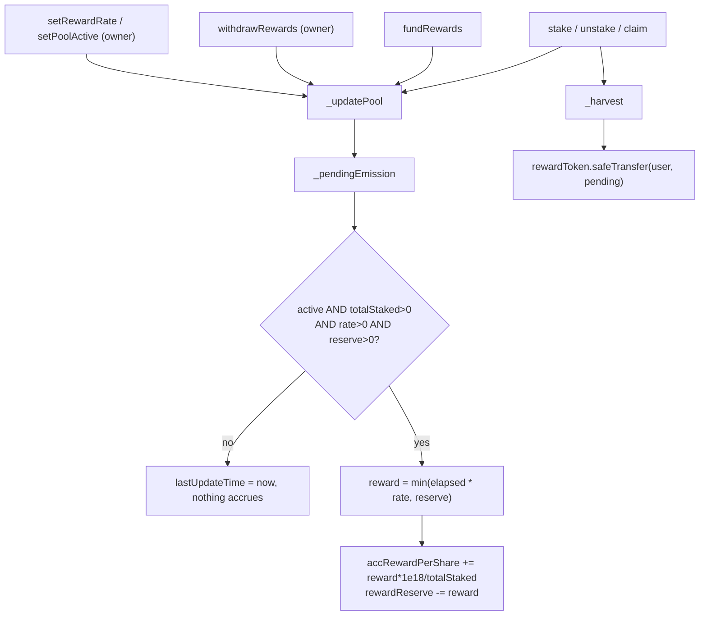

# Security review — `PledgeStaking`

Report only. No Solidity was changed and no on-chain action was taken as part of this review.

## 1. Scope

| Item | Value |
|---|---|
| Commit | `b09f64c` (2026-09-10) |
| Compiler | `v0.8.24+commit.e11b9ed9`, optimizer on, 200 runs, EVM `cancun` |
| Chain | Robinhood Mainnet, chainId 4663 |
| Proxy | `0xEe8c2E6ED39B79Cd6806926d96CD570F5b94bF07` (`PledgeFinanceStaking`) |
| Implementation | `0x4de94A31e0725270b047820293e784bb62363Be3` |

Files reviewed:

- [src/core/PledgeStaking.sol](src/core/PledgeStaking.sol) — the staking contract
- [src/upgrade/PledgeUupsOwnable.sol](src/upgrade/PledgeUupsOwnable.sol) — ownership and `_authorizeUpgrade`
- [src/upgrade/PledgeFinanceProxies.sol](src/upgrade/PledgeFinanceProxies.sol) — the `PledgeFinanceStaking` proxy
- [script/mainnet/10_DeployStaking.s.sol](script/mainnet/10_DeployStaking.s.sol) — deployment parameters
- [deployments/4663.json](deployments/4663.json) and [address-smartcontract](address-smartcontract) — live state
- [test/PledgeStaking.t.sol](test/PledgeStaking.t.sol) — coverage assessment

Out of scope: the vault, oracle, surplus buffer, stability pool, the PONS token itself, and the Robinhood chain's own consensus or RPC behavior.

## 2. Executive summary

`PledgeStaking` is a MasterChef-style staking contract: a per-pool `accRewardPerShare` accumulator, linear per-second emissions, and a `rewardReserve` that caps how much can ever be emitted. Each pool is isolated, with its own stake token, reward token, emission rate, and lock window.

**The reward accounting is sound.** I could not find a way for one user to take another user's principal or rewards. Reentrancy is closed off by a single shared guard across every state-changing entry point, the implementation cannot be hijacked because its initializers are disabled at construction, `withdrawRewards` provably cannot reach staked principal, and emissions stop by themselves when the reserve is exhausted rather than reverting on `claim`.

**The risk is concentrated in owner powers and in the current live state, not in the math.** Three things stand out. The two live pools are seeded with the deprecated launchpad PLG token rather than PONS, so anyone staking today locks a dead token for up to 90 days and is paid in a dead token. The owner is still the deployer EOA, which holds the UUPS upgrade key and could replace the implementation and take everything. And there is no emergency exit: withdrawing principal is coupled to a successful reward-token transfer, so a single misbehaving reward token bricks principal permanently.

| Severity | Count |
|---|---|
| Critical | 1 |
| High | 3 |
| Medium | 5 |
| Low / Informational | 6 |

## 3. Function inventory

### 3.1 Owner-only

| Signature | Effect |
|---|---|
| `initialize(address owner_)` | Sets `owner`. Guarded by `initializer`, callable once through the proxy. |
| `addPool(address stakeToken, address rewardToken, uint256 rewardRatePerSecond, uint256 lockDuration, bool active)` | Creates a pool with `minLockDuration` forced to 0. Returns the new `poolId`. |
| `addPool(address stakeToken, address rewardToken, uint256 rewardRatePerSecond, uint256 minLockDuration, uint256 lockDuration, bool active)` | Same, with an explicit minimum lock. |
| `setLockDuration(uint256 poolId, uint256 minLockDuration, uint256 lockDuration)` | Changes the allowed lock range for future stakes. Existing `lockedUntil` values are not rewritten. |
| `setRewardRate(uint256 poolId, uint256 rewardRatePerSecond)` | Settles accrued emissions first, then changes the rate. No upper bound. |
| `setPoolActive(uint256 poolId, bool active)` | Settles first, then flips the flag. `false` blocks new stakes only; `unstake` and `claim` stay open. |
| `setPoolName(uint256 poolId, string name_)` | Display label, stored in `poolNames`. |
| `withdrawRewards(uint256 poolId, address to, uint256 amount)` | Pulls unaccrued reward inventory out of the pool. Bounded by `rewardReserve`. |
| `transferOwnership(address newOwner)` | Inherited. Single step, no acceptance by the new owner. |
| `upgradeToAndCall(address impl, bytes data)` | Inherited from `UUPSUpgradeable`, gated by `_authorizeUpgrade` which is `onlyOwner`. |

### 3.2 Permissionless

| Signature | Effect |
|---|---|
| `fundRewards(uint256 poolId, uint256 amount)` | Pulls `amount` of the pool's reward token from the caller and adds it to `rewardReserve`. Anyone may call it; only the owner can ever take it back out. |
| `stake(uint256 poolId, uint256 amount)` | Stakes using the pool's **maximum** lock duration. |
| `stake(uint256 poolId, uint256 amount, uint256 lockDuration)` | Stakes with a caller-chosen lock inside `[minLockDuration, lockDuration]`. |
| `unstake(uint256 poolId, uint256 amount)` | Harvests, then returns principal. Reverts with `LockActive` until `block.timestamp >= lockedUntil`. |
| `claim(uint256 poolId)` | Harvests pending rewards only. |

Both `stake` and `addPool` are overloaded. Integrators using ethers.js or viem must disambiguate with the full signature (for example `stake(uint256,uint256,uint256)`), not the bare name.

### 3.3 Views

| Signature | Returns |
|---|---|
| `poolCount()` | Number of pools. |
| `pools(uint256 poolId)` | Ten fields: `stakeToken`, `rewardToken`, `rewardRatePerSecond`, `totalStaked`, `accRewardPerShare`, `lastUpdateTime`, `minLockDuration`, `lockDuration`, `active`, `rewardReserve`. |
| `getPosition(uint256 poolId, address account)` | `amount`, `pending`, `lockedUntil`, `lockDuration`, `lockRemaining`. The dashboard helper. |
| `pendingReward(uint256 poolId, address account)` | Claimable rewards including emissions not yet settled to storage. |
| `users(uint256 poolId, address account)` | Auto-generated getter: `amount`, `rewardDebt`, `lockedUntil`, `lockDuration`. |
| `poolNames(uint256 poolId)` | Auto-generated getter for the display label. |
| `nextEpochEnds()` | Next multiple of `EPOCH_DURATION`. Not used anywhere else — see L-2. |
| `owner()` | Current owner. |
| `name()`, `version()` | `"Pledge Finance Staking"`, `"1.0.0"`. Constants, so an upgrade cannot change them without changing the bytecode. |
| `ACC_PRECISION()`, `EPOCH_DURATION()` | `1e18`, `7 days`. |
| `proxiableUUID()` | Inherited ERC-1822 slot identifier. |

### 3.4 Internal

`_addPool`, `_stake`, `_harvest`, `_updatePool`, `_pendingEmission`, `_pool` (bounds check plus storage pointer), and `_authorizeUpgrade`.

## 4. Architecture

Every state-changing path funnels through the same three steps: settle the pool's emissions to storage, pay out whatever the caller has accrued, then mutate the position.



The safety property the design rests on is a per-token balance invariant. For any token `T`:

```
balanceOf(T, staking) >= Σ totalStaked(pools staking T)
                       + Σ rewardReserve(pools rewarding T)
                       + unclaimed accrued rewards in T
```

This holds because `_updatePool` moves value out of `rewardReserve` and into `accRewardPerShare` in the same statement, so rewards that have already accrued to users are no longer part of the reserve that `withdrawRewards` is allowed to touch. The invariant is what makes it safe for a pool to use the same token for staking and rewards, which pool 0 does.

The invariant assumes that every `transfer` and `transferFrom` moves exactly the requested amount. M-1 below is the case where that assumption breaks.

## 5. Findings

### C-1 — Live pools are seeded with a deprecated token, and the USDG pool pays nothing

[deployments/4663.json](deployments/4663.json) records the live configuration of proxy `0xEe8c…bF07`:

```json
"0": {
  "name": "PLG Staking",
  "stakeToken": "old launchpad PLG 0xDfC0a301CA6F62c32800C4827974ECac64BC7e38",
  "rewardToken": "old launchpad PLG",
  "minLock": "1 day", "lock": "90 days",
  "rewardReserve": "550000e18"
},
"1": {
  "name": "USDG Staking",
  "stakeToken": "USDG", "rewardToken": "old launchpad PLG",
  "minLock": "0", "lock": "0", "rewardReserve": "0"
}
```

The same file lists `0xDfC0a301…` under `deprecated` as `old_launchpad_PLG`, and [address-smartcontract](address-smartcontract) marks it "Abandoned earlier". The `staking` block acknowledges the gap directly: *"live pools 0/1 were seeded with the old launchpad PLG and have not been rotated yet"*.

The deployment script it was supposed to match uses PONS throughout:

[script/mainnet/10_DeployStaking.s.sol:37-40](script/mainnet/10_DeployStaking.s.sol)

```solidity
        uint256 ponsPool = staking.addPool(PONS, PONS, rewardRate, 1 days, 90 days, true);
        staking.setPoolName(ponsPool, "PONS Staking");

        uint256 usdgPool = staking.addPool(USDG, PONS, 0, 0, true);
```

**Impact.** Anyone who stakes into pool 0 today deposits an abandoned token, is locked for up to 90 days, and is paid rewards in that same abandoned token. Pool 0 is `active`, so nothing at the contract level stops this. Pool 1 is worse in a different way: `rewardRatePerSecond` is 0 and `rewardReserve` is 0, so `_pendingEmission` returns 0 on every call and USDG stakers accrue exactly nothing while their USDG sits in the contract. Because pool 1 has `lock = 0` they can leave at any time, which limits the damage to opportunity cost, but the UI will still present it as a staking product.

**Recommendation.** Treat this as an operational incident rather than a code bug. Set both pools inactive so no new stake can enter, recover the 550k PLG reserve via `withdrawRewards`, and create fresh pools against PONS `0x1BE3010124C86e8a03c6Fb6e91c534D4A2b1fFCf`. Note that `setPoolActive(false)` does not evict existing stakers and does not shorten their locks — anyone already in pool 0 stays locked on the deprecated token until their `lockedUntil` passes. Until the rotation is done, the staking product should not be linked from any user-facing surface.

### H-1 — Owner is still the deployer EOA and holds the UUPS upgrade key

[deployments/4663.json](deployments/4663.json) states the owner is `0x82FBf39835a885C1CdA3D756FB6AA79802f29e92`, type `deployer EOA`, with handover to the 48-hour timelock `0x1195e53E…` listed as `pending`. [address-smartcontract](address-smartcontract) repeats this under "Governance (handover still pending)". The script that would perform the handover, [11_TransferOwnershipToTimelock.s.sol](script/mainnet/11_TransferOwnershipToTimelock.s.sol), has not been run.

Upgrade authorization is a bare owner check:

[src/upgrade/PledgeUupsOwnable.sol:48](src/upgrade/PledgeUupsOwnable.sol)

```solidity
    function _authorizeUpgrade(address) internal override onlyOwner {}
```

**Impact.** A single private key can call `upgradeToAndCall` with an arbitrary implementation and drain every staked principal and every reward reserve in one transaction, with no delay and no second signature. This is the largest single risk in the contract and it is not mitigated by anything in the code. The same key also governs the vault, oracle, surplus buffer, and stability pool.

A secondary problem compounds it: ownership transfer is single-step, with no acceptance step from the incoming owner.

[src/upgrade/PledgeUupsOwnable.sol:42-46](src/upgrade/PledgeUupsOwnable.sol)

```solidity
    function transferOwnership(address newOwner) external onlyOwner {
        if (newOwner == address(0)) revert ZeroAddress();
        emit OwnershipTransferred(owner, newOwner);
        owner = newOwner;
    }
```

The only validation is a non-zero check. A mistyped address that happens to be a valid but uncontrolled address permanently bricks all administration, including the ability to upgrade away from the mistake. Running the handover script is exactly the operation where this risk is highest.

**Recommendation.** Execute the handover to the timelock, with the 3-of-4 Safe `0x509dC4A8…` as proposer. Before doing so, simulate the transaction and verify the timelock address byte for byte. A two-step transfer would be the usual fix, but the storage note in `PledgeUupsOwnable` forbids adding a plain state variable to that contract; if two-step ownership is wanted later it must go into an ERC-7201 namespaced struct, as that comment already prescribes.

### H-2 — The owner can withdraw the entire remaining reward budget while users are locked

[src/core/PledgeStaking.sol:194-203](src/core/PledgeStaking.sol)

```solidity
    function withdrawRewards(uint256 poolId, address to, uint256 amount) external onlyOwner nonReentrant {
        if (to == address(0)) revert ZeroAddress();
        if (amount == 0) revert ZeroAmount();
        _updatePool(poolId);
        PoolInfo storage pool = _pools[poolId];
        if (amount > pool.rewardReserve) revert InsufficientRewardReserve();
        pool.rewardReserve -= amount;
        pool.rewardToken.safeTransfer(to, amount);
        emit RewardsWithdrawn(poolId, to, amount);
    }
```

The `_updatePool` call on line 197 is a genuine protection and it works: rewards that have already accrued have left `rewardReserve` by the time the bound on line 199 is checked, so the owner cannot claw back what users have already earned. `test_withdrawRewardsCannotTakeStakedPrincipal` covers the principal half of this.

**Impact.** What is not protected is everything users have *not* yet earned. The owner can withdraw the whole remaining budget at any moment, which sets future emissions to zero via the `rewardReserve == 0` branch of `_pendingEmission`. Stakers cannot respond: `unstake` reverts with `LockActive` until their lock expires. For pool 0's 90-day lock, that is up to 90 days of being locked in a pool that pays nothing. The contract offers no counterbalance — locks do not release when emissions stop, and there is no minimum notice period.

This is a trust assumption rather than an exploit, but it is one that a staker cannot verify or opt out of, and it is not documented anywhere user-facing.

**Recommendation.** At minimum, document it plainly wherever the staking product is presented. Structurally, the options are to require that `rewardReserve` always covers the remaining locked term before a withdrawal is allowed, or to release locks automatically once a pool's reserve or rate hits zero. Either is a code change and is out of scope for this report.

### H-3 — No emergency exit; principal withdrawal depends on the reward transfer succeeding

[src/core/PledgeStaking.sol:231-240](src/core/PledgeStaking.sol)

```solidity
    function unstake(uint256 poolId, uint256 amount) external nonReentrant {
        if (amount == 0) revert ZeroAmount();
        PoolInfo storage pool = _pool(poolId);

        _updatePool(poolId);
        _harvest(poolId, msg.sender);

        UserInfo storage user = users[poolId][msg.sender];
        if (user.amount < amount) revert InsufficientStake();
        if (block.timestamp < user.lockedUntil) revert LockActive();
```

`_harvest` runs before any principal is returned, and it ends in an unconditional transfer:

[src/core/PledgeStaking.sol:323-324](src/core/PledgeStaking.sol)

```solidity
        pool.rewardToken.safeTransfer(account, pending);
        emit RewardClaimed(poolId, account, pending);
```

**Impact.** If that transfer ever reverts, `unstake` reverts with it and the caller's principal is stuck. The reward token is chosen per pool by the owner and can be any ERC-20, so the failure modes are real: a pausable token that gets paused, a token with a blacklist that blacklists the staker or the staking contract, or a reward-token balance that has drifted below what the accounting expects (see M-1). None of these are recoverable, because `unstake` is the only path out and there is no function that returns principal while skipping the harvest.

MasterChef and every derivative I am aware of ships an `emergencyWithdraw` precisely for this: it returns `user.amount`, zeroes `rewardDebt`, and never touches the reward token. `PledgeStaking` has no equivalent, and neither does the proxy.

**Recommendation.** An `emergencyWithdraw(uint256 poolId)` that forfeits pending rewards and returns principal without calling the reward token. Whether it should also bypass the lock is a product decision; bypassing it is the more defensible choice for a function that only exists for when something has already gone wrong.

### M-1 — Fee-on-transfer and rebasing tokens silently corrupt the accounting

Both deposit paths credit the requested amount rather than the amount actually received:

[src/core/PledgeStaking.sol:297-305](src/core/PledgeStaking.sol)

```solidity
        pool.stakeToken.safeTransferFrom(msg.sender, address(this), amount);

        UserInfo storage user = users[poolId][msg.sender];
        user.amount += amount;
        user.rewardDebt = (user.amount * pool.accRewardPerShare) / ACC_PRECISION;
        uint256 newLockedUntil = block.timestamp + lockDuration;
        if (newLockedUntil > user.lockedUntil) user.lockedUntil = newLockedUntil;
        user.lockDuration = lockDuration;
        pool.totalStaked += amount;
```

[src/core/PledgeStaking.sol:188-189](src/core/PledgeStaking.sol)

```solidity
        pool.rewardToken.safeTransferFrom(msg.sender, address(this), amount);
        pool.rewardReserve += amount;
```

**Impact.** With a fee-on-transfer stake token, `Σ user.amount` exceeds the contract's real balance and the last stakers to exit cannot withdraw — their `unstake` reverts on the principal transfer. With a fee-on-transfer reward token, `rewardReserve` exceeds the real balance, so the final harvests revert; combined with H-3 that also strands principal in pools where stake and reward token are the same. Rebasing tokens break the invariant in both directions.

PONS and USDG both appear to be standard ERC-20s, so no live pool is affected today. The exposure is forward-looking: `addPool` accepts any address, and the contract gives an operator no signal that a token is unsuitable.

**Recommendation.** Measure the balance delta around each `transferFrom` and credit that, or document a hard rule that only standard non-rebasing, non-fee ERC-20s may ever be passed to `addPool`.

### M-2 — The default `stake` uses the longest lock and re-locks the entire position

[src/core/PledgeStaking.sol:221-229](src/core/PledgeStaking.sol)

```solidity
    /// @notice Stake using the pool's maximum lock duration.
    function stake(uint256 poolId, uint256 amount) external nonReentrant {
        _stake(poolId, amount, _pool(poolId).lockDuration);
    }

    /// @notice Stake with a custom lock in `[minLockDuration, lockDuration]`.
    function stake(uint256 poolId, uint256 amount, uint256 lockDuration) external nonReentrant {
        _stake(poolId, amount, lockDuration);
    }
```

Two behaviors compound here. The two-argument overload — the one an integrator reaches for by default — silently selects the pool *maximum*, which is 90 days for pool 0. And `lockedUntil` in `_stake` line 303 applies to the whole position, not just the increment.

**Impact.** A user 89 days into a 90-day lock who tops up by one token through `stake(poolId, amount)` re-locks their entire balance for another 90 days. Nothing warns them, and there is no way to undo it. The existing test `test_restakeCannotShortenActiveLock` only verifies that a lock cannot be *shortened*, so this case is not covered.

The `if (newLockedUntil > user.lockedUntil)` check is the right guard against shortening, and per-deposit lock tracking would be a much larger change. The practical issue is the default overload's choice of maximum rather than minimum.

**Recommendation.** Have the frontend always call the three-argument overload with an explicit duration, and show the resulting new unlock date for the full position before the user signs. If the contract is ever revised, defaulting to `minLockDuration` would be the less surprising choice.

### M-3 — Lock duration has no effect on rewards

`lockDuration` and `minLockDuration` appear only in validation (`_stake` line 292) and in computing `lockedUntil`. They are absent from `_updatePool`, `_pendingEmission`, `_harvest`, and `pendingReward`. There is no weight, multiplier, or boost anywhere in the contract; `accRewardPerShare` is applied to raw `user.amount`.

**Impact.** In pool 0 a user who locks for the 1-day minimum and a user who locks for the 90-day maximum earn an identical rate on identical principal. Locking is pure downside — it transfers optionality from the user to the protocol and returns nothing. Rational users will always pick `minLockDuration`, which makes the lock range pointless in practice while still exposing anyone who used the default overload (M-2) to a 90-day lock-in.

This is an economic design gap rather than a vulnerability, but it undercuts the stated purpose of having a lock range at all.

**Recommendation.** Either introduce a weight so that longer locks earn more, or drop the lock entirely and let the range collapse to zero. If neither is done, at least stop presenting lock duration as a user choice with a benefit attached.

### M-4 — Non-upgradeable `ReentrancyGuard` behind a proxy occupies a storage slot, with no gaps anywhere

[src/core/PledgeStaking.sol:15](src/core/PledgeStaking.sol)

```solidity
contract PledgeStaking is PledgeUupsOwnable, ReentrancyGuard {
```

This is the plain `ReentrancyGuard` from `@openzeppelin/contracts/utils`, not the upgradeable variant. Its `_status` is set in a constructor, which for a proxied contract runs against the implementation's storage, never the proxy's. The proxy's slot 1 therefore starts at 0 rather than `NOT_ENTERED`.

Functionally this is safe today. OZ v5's `_nonReentrantBefore` only checks `if (_status == ENTERED)`, so a zero value passes, is set to `ENTERED`, and is reset to `NOT_ENTERED` afterwards. The guard does protect every entry point, and because all five state-changing functions share one guard, cross-function reentrancy through a callback-capable token is blocked as well.

**Impact.** The real exposure is layout, not behavior. The resulting slot order is `owner` at 0, `_status` at 1, `_pools` at 2, `users` at 3, `poolNames` at 4, with no storage gap anywhere in the hierarchy — [deployments/4663.json](deployments/4663.json) confirms this under `upgradeRules`: *"there are no storage gaps anywhere"*. If a future implementation drops the guard, reorders the inheritance list, or swaps in `ReentrancyGuardTransient` (which stores nothing), every slot from 1 onward shifts and the live proxy's storage is corrupted. That is precisely the incident class documented in the header of [PledgeUupsOwnable.sol](src/upgrade/PledgeUupsOwnable.sol), which notes it "happened once".

There is also a minor gas cost: because slot 1 starts at zero on the proxy, the first `nonReentrant` call pays a cold zero-to-nonzero `SSTORE` instead of the cheaper warm write the guard was designed for.

**Recommendation.** Add the inheritance list itself to the documented upgrade rules — the base contract order of `PledgeStaking` must never change. Verify any future implementation with an automated storage-layout diff against the deployed one rather than by inspection.

### M-5 — `PoolInfo` lives in a dynamic array, so its fields can never be extended

[src/core/PledgeStaking.sol:45-47](src/core/PledgeStaking.sol)

```solidity
    PoolInfo[] private _pools;
    mapping(uint256 poolId => mapping(address account => UserInfo)) public users;
    mapping(uint256 poolId => string) public poolNames;
```

`PoolInfo` is 10 slots per element inside a dynamic array. Elements are packed consecutively from `keccak256(2)`, so the struct size is the array's stride. Appending a field changes the stride and re-addresses every element after the first — pool 1's data would be read from the middle of pool 0's.

The documented rule in [deployments/4663.json](deployments/4663.json) is *"Append only. New variables go at the end of the leaf contract."* That rule is correct for top-level variables but does not cover this case, and following it naively — appending a field to `PoolInfo` because it is "at the end" — would corrupt all live pool data.

`UserInfo` does not have this problem: it sits in a mapping, where each entry is addressed independently at `keccak256(key, slot)`, so appending a field there is the normal safe case.

Note that `rewardReserve` was itself appended to `PoolInfo` in commit `218548a`. That was safe only because the 2026-09-09 redeploy was a fresh proxy with the field already present. The same move against the current live proxy would not be.

**Recommendation.** State explicitly in the upgrade rules that `PoolInfo` is frozen. Any new per-pool field must go into a separate top-level mapping keyed by `poolId`, appended after `poolNames`.

### L-1 — Truncation in `_updatePool` burns reward dust

[src/core/PledgeStaking.sol:327-335](src/core/PledgeStaking.sol)

```solidity
    function _updatePool(uint256 poolId) internal {
        PoolInfo storage pool = _pool(poolId);
        uint256 reward = _pendingEmission(pool);
        if (reward > 0) {
            pool.accRewardPerShare += (reward * ACC_PRECISION) / pool.totalStaked;
            pool.rewardReserve -= reward;
        }
        pool.lastUpdateTime = block.timestamp;
    }
```

`rewardReserve` is debited by the full `reward` while `accRewardPerShare` receives a floored quotient. The remainder is credited to nobody and can never be claimed or withdrawn, since `withdrawRewards` is bounded by the already-decremented reserve.

Per settlement the loss is at most `totalStaked / 1e18` wei of reward token. At pool 0's scale that is on the order of `1e-11` PONS per update — economically irrelevant. Anyone can call `claim` once per block to force a settlement and maximize the rounding loss, but the amplification does not make it meaningful at these parameters. It would matter for a pool with a very large `totalStaked` denominated in a low-decimal token.

### L-2 — `EPOCH_DURATION` and `nextEpochEnds()` are dead code that imply behavior that does not exist

[src/core/PledgeStaking.sol:130-132](src/core/PledgeStaking.sol)

```solidity
    function nextEpochEnds() external view returns (uint256) {
        return ((block.timestamp / EPOCH_DURATION) + 1) * EPOCH_DURATION;
    }
```

`EPOCH_DURATION` appears only here. Emissions are continuous and per-second; there is no epoch boundary, nothing happens at one, and no reward is batched or released on that schedule. An integrator reading the ABI would reasonably build a "rewards distribute in N days" countdown that is pure fiction.

### L-3 — `setRewardRate` is unbounded

The owner can set any `rewardRatePerSecond`. Because `_pendingEmission` caps a single settlement at the full remaining `rewardReserve`, a sufficiently large rate drains a 90-day budget into one block's accrual, split across whoever happens to be staked at that moment. There is no maximum, no rate-of-change limit, and no timelock at the contract level.

### L-4 — Pools cannot be retired, and names are freely rewritable

There is no `removePool`. A misconfigured pool can only be set inactive, which leaves it in `_pools` and in `poolCount()` forever — every frontend enumerating pools must filter it out itself. Separately, `setPoolName` can be called at any time on a live pool, so the label shown next to a user's locked position can be changed after they have staked.

### L-5 — `_pendingEmission` copies the whole struct out of storage

[src/core/PledgeStaking.sol:337](src/core/PledgeStaking.sol)

```solidity
    function _pendingEmission(PoolInfo memory pool) internal view returns (uint256 reward) {
```

The parameter is `memory`, so passing the storage pointer from `_updatePool` line 329 forces a full 10-slot copy on every settlement, when the function reads at most five fields. `pendingReward` does the same at line 206. Changing the parameter to `PoolInfo storage` would remove roughly five redundant `SLOAD`s from every `stake`, `unstake`, `claim`, `fundRewards`, and owner setter call.

### L-6 — Documentation contradicts the deployed reality

Three stale claims, all of which would mislead someone reasoning about the live system:

[product.md](product.md) line 255 marks `PledgeStaking.sol` as "testnet only (OUT of mainnet scope)" and line 283 puts staking in the "Out" row of the risk table with "Testnet-only, never going to 4663". The contract is deployed on 4663 and holds a 550k reward reserve.

[product.md](product.md) line 608 states that "`fundRewards` is public with no accounting, so rewards can be underfunded and `claim` will revert". The `rewardReserve` mechanism introduced in commit `218548a` makes this false — emissions are capped at the reserve, so `claim` returns zero rather than reverting. `test_emissionsStopWhenReserveRunsOut` demonstrates the corrected behavior.

The same outdated claim survives in the deployment script header:

[script/mainnet/10_DeployStaking.s.sol:12-14](script/mainnet/10_DeployStaking.s.sol)

```solidity
/// @dev Two pools: PONS staked for PONS rewards over a 90 day program, and USDG staked for PONS at a
///      zero rate until a rate is set. `fundRewards` moves the whole reward reserve up front
///      because the contract has no accounting that would stop `claim` reverting if underfunded.
```

## 6. Test coverage

[test/PledgeStaking.t.sol](test/PledgeStaking.t.sol) contains 17 tests. The happy paths are covered properly: proportional reward splitting, emission cutoff when the reserve empties, the inactive-pool semantics, lock enforcement including the custom-duration range, proxy initialization, and the two `withdrawRewards` bounds. That is a reasonable baseline.

What is missing:

- **No fuzz or invariant tests.** Every test is a fixed-value `test_`. The balance invariant from section 4 is exactly the kind of property an invariant test should be asserting continuously against random sequences of stake, unstake, claim, fund, and withdraw.
- **No reentrancy test.** The guard is never exercised with a callback-capable token, so nothing would catch its removal in a refactor.
- **No non-standard token tests.** Fee-on-transfer and rebasing (M-1) are untested, as is a reverting or pausable reward token (H-3).
- **No storage-layout test.** Given M-4 and M-5 and the incident referenced in `PledgeUupsOwnable`, an upgrade test that writes pool and user state, upgrades, and re-reads it would be the highest-value addition. [PledgeVaultManager.t.sol](test/PledgeVaultManager.t.sol) already does "upgrade storage" testing; staking has no equivalent.
- **No decimal-mismatch test.** Live pool 1 stakes a 6-decimal token and pays an 18-decimal reward. The test suite only uses 18-decimal mocks, so the real decimal combination is never exercised.
- **No multi-pool shared-token test.** Nothing asserts that two pools sharing a reward token keep their reserves isolated.

One small nit: lines 38-39 wrap `plg.mint(bob, ...)` in `vm.prank(bob)`, which has no effect since `MockERC20.mint` is unpermissioned.

## 7. Checked and found sound

Recording these so a future reviewer does not have to re-derive them:

- **Cross-function reentrancy is closed.** All five state-changing entry points share a single `nonReentrant` guard, so a callback from an ERC-777-style token inside `_harvest` cannot re-enter any of them, including a different pool.
- **The implementation cannot be hijacked.** It is deployed with `new PledgeStaking(address(0))`, and `_disableAndMaybeSetOwner(address(0))` skips setting an owner and calls `_disableInitializers()`. `initialize` on the implementation reverts, and `UUPSUpgradeable`'s `onlyProxy` blocks a direct `upgradeToAndCall` against it.
- **`withdrawRewards` cannot reach principal.** The `_updatePool` call precedes the bound check, so accrued rewards are already out of `rewardReserve`, and staked principal was never in it. Verified by `test_withdrawRewardsCannotTakeStakedPrincipal`.
- **Emissions degrade gracefully.** When the reserve empties, `_pendingEmission` returns 0 rather than letting the contract promise rewards it cannot pay. `claim` returns zero instead of reverting.
- **No cross-pool drain.** Reserves are per-pool even when several pools share a reward token, as live pools 0 and 1 do. Every `withdrawRewards` is bounded by its own pool's reserve.
- **No retroactive emission to an empty pool.** `_pendingEmission` returns 0 while `totalStaked == 0`, but `_updatePool` still advances `lastUpdateTime`, so the idle period is skipped rather than paid out in a lump to the first staker who arrives.
- **`setPoolActive` settles in the correct order.** Deactivating accrues up to the current timestamp before the flag flips; reactivating advances `lastUpdateTime` without accruing, so a pause neither loses nor duplicates emissions.
- **Just-in-time staking is not profitable.** Emission is strictly proportional to time held, and within a single block `elapsed == 0` yields nothing, so a flash-loaned deposit and withdrawal in one transaction earns zero. This matters because live pool 1 has no lock at all.
- **No unbounded loops.** There is no `massUpdatePools`; every function touches exactly one pool, so adding pools never creates a gas-limit DoS.
- **No ETH handling.** There is no `receive` or `payable` function, so ETH sent to the proxy reverts rather than becoming stuck.

## 8. Recommendations, in priority order

**Operational — no code change required.**

1. Set live pools 0 and 1 inactive and stop linking staking from any user-facing surface until the token rotation is complete (C-1).
2. Recover the 550k launchpad PLG reserve with `withdrawRewards`, then create replacement pools against PONS `0x1BE3010124C86e8a03c6Fb6e91c534D4A2b1fFCf` (C-1). Existing pool 0 stakers stay locked on the deprecated token until their `lockedUntil` passes; plan a direct remedy for them.
3. Execute the ownership handover to timelock `0x1195e53E…` with the 3-of-4 Safe as proposer, simulating the transaction first and verifying the address byte for byte (H-1).
4. Document the owner's ability to withdraw the unaccrued reward budget wherever staking is presented to users (H-2).
5. Change the frontend to always call `stake(uint256,uint256,uint256)` with an explicit duration, and show the resulting unlock date for the whole position before signing (M-2).
6. Extend the upgrade rules in [deployments/4663.json](deployments/4663.json) to state that `PoolInfo` is frozen and that `PledgeStaking`'s inheritance list must not change (M-4, M-5).
7. Correct the stale claims in [product.md](product.md) lines 255, 283, 608 and in the header of [10_DeployStaking.s.sol](script/mainnet/10_DeployStaking.s.sol) (L-6).

**Code changes for a future `PledgeStaking` v1.1, should one be built.**

8. Add `emergencyWithdraw(uint256 poolId)` returning principal without touching the reward token (H-3).
9. Credit measured balance deltas in `_stake` and `fundRewards`, or codify a hard rule restricting `addPool` to standard ERC-20s (M-1).
10. Decide whether lock duration should carry a reward weight or be removed (M-3).
11. Bound `setRewardRate` (L-3); remove `EPOCH_DURATION` and `nextEpochEnds()` (L-2); change `_pendingEmission` to take a storage pointer (L-5).
12. Add an invariant test for the section 4 balance property, an upgrade storage-layout test, and tests for non-standard tokens and 6-decimal stake tokens (section 6).
