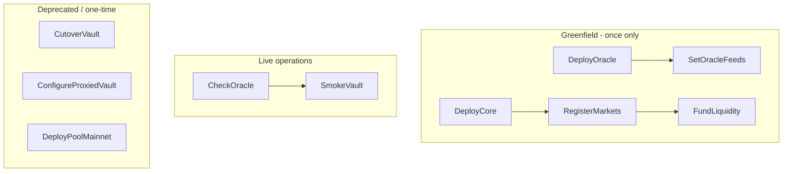

# Mainnet Script Audit — Production Readiness

Read-only audit of 14+ Foundry mainnet scripts in this monolith (`pladge-smartcontract`).

**Overview:** Core operational scripts (oracle, register markets, fund liquidity, smoke test) are mostly sound, but there is **one fatal hardcoded-address bug**, several operational footguns, and many migration/deploy scripts that are **stale** relative to the live system. Not fully production-hardened without workflow fixes and guards.

Canonical live vault (manifest + `continue-mainnet.cmd`):

- `MAINNET_VAULT_MANAGER = 0x0dfd39ff00aFa2283A8c37770dB972aeC08AaB62`

See [`deployments/4663.json`](./deployments/4663.json).

---

## Executive summary

| Category | Status |
|---|---|
| Live operational scripts (post-deploy) | **Mostly OK** — needs 2-step oracle workflow + guards |
| Greenfield deploy scripts | **OK for first deploy** — dangerous if re-run on live mainnet |
| Migration / cutover scripts | **Unsafe** — stale addresses, wrong targets, incomplete |
| Mainnet script test coverage | **None** |
| Chain / preflight validation | **None** in all scripts |

**Verdict:** Mainnet scripts are **not fully production-ready** for operators without a strict runbook. The critical bug is in [`script/ConfigureProxiedVaultMainnet.s.sol`](./script/ConfigureProxiedVaultMainnet.s.sol). Against the live system (`MAINNET_VAULT_MANAGER=0x0dfd39ff...`), only a subset of scripts is safe to use.

---

## Intended mainnet workflow



---

## Findings by severity

### CRITICAL — wrong hardcoded address

**File:** [`script/ConfigureProxiedVaultMainnet.s.sol`](./script/ConfigureProxiedVaultMainnet.s.sol)

```solidity
address internal constant PROXY = 0x1757a7BD9078001adD29d98Ba712DA7ba154C1AE;
```

This address is **not** the vault proxy. It is the **AMZN Chainlink feed** (same address as in [`script/RegisterMainnetMarkets.s.sol`](./script/RegisterMainnetMarkets.s.sol) and [`deployments/4663.json`](./deployments/4663.json)).

Correct mainnet vault:

- `MAINNET_VAULT_MANAGER = 0x0dfd39ff00aFa2283A8c37770dB972aeC08AaB62`

**Impact:** The script fails at `require(vault.owner() == deployer)` or, if it somehow proceeds, calls functions on a non-vault contract. **Do not run this script.**

---

### HIGH — operational gaps and footguns

#### 1. Register markets without wiring oracle feeds

[`script/RegisterMainnetMarkets.s.sol`](./script/RegisterMainnetMarkets.s.sol) stores `feed` in a struct but **only logs** it — it does not call `oracle.setFeed()`.

Feed wiring lives only in [`script/SetOracleFeeds.s.sol`](./script/SetOracleFeeds.s.sol).

**Impact:** Running `RegisterMainnetMarkets` without `SetOracleFeeds` first causes `deposit`/`borrow` to revert with `"ORACLE: no feed"` from [`src/oracle/PledgeChainlinkOracle.sol`](./src/oracle/PledgeChainlinkOracle.sol).

**Recommendation:** Preflight `oracle.feeds(token) != 0` before register, or combine both steps.

#### 2. `continue-mainnet.cmd` redeploys the pool

[`continue-mainnet.cmd`](./continue-mainnet.cmd) step 2 runs `DeployPoolMainnet.s.sol`, but the pool is already live at `0x8570a571CC83f87B3Ca4249B71646Cc807350e14` ([`deployments/4663.json`](./deployments/4663.json)).

[`script/DeployPoolMainnet.s.sol`](./script/DeployPoolMainnet.s.sol) does not check for an existing pool — it always deploys a new proxy.

**Impact:** Re-run creates an orphan stability pool; manifests/integrations may still point at the old contract.

#### 3. No `block.chainid == 4663` validation

All mainnet scripts rely on the CLI flag `--chain-id 4663`. There is no in-script guard such as:

```solidity
require(block.chainid == 4663, "wrong chain");
```

**Impact:** Wrong RPC URL → broadcast to another chain without a clear script-level error.

#### 4. Deploy scripts are not idempotent

These scripts **always deploy new contracts** with no existing-deployment check:

- [`DeployMainnet.s.sol`](./script/DeployMainnet.s.sol) / [`DeployCoreMainnet.s.sol`](./script/DeployCoreMainnet.s.sol) — near-duplicate roles
- [`DeployVaultMainnet.s.sol`](./script/DeployVaultMainnet.s.sol)
- [`DeployPoolMainnet.s.sol`](./script/DeployPoolMainnet.s.sol)
- [`CutoverVaultMainnet.s.sol`](./script/CutoverVaultMainnet.s.sol) — also withdraws all surplus to the deployer

**Impact:** Accidental re-run = duplicate infra and address confusion.

#### 5. `REGISTER_LIMIT` defaults to 1

[`RegisterMainnetMarkets.s.sol`](./script/RegisterMainnetMarkets.s.sol):

```solidity
uint256 limit = vm.envOr("REGISTER_LIMIT", uint256(1));
```

Default registers **one market** only. [`continue-mainnet.cmd`](./continue-mainnet.cmd) sets `REGISTER_LIMIT=8`, but a manual/README run can omit it.

**Impact:** Partial market registration with no hard error — operators must inspect logs.

#### 6. Missing owner preflight on some admin scripts

| Script | Missing guard |
|---|---|
| `RegisterMainnetMarkets` | `vault.owner() == deployer` |
| `DeployPoolMainnet` | `pool.owner() == deployer` (implicit via broadcast) |
| `WithdrawSurplusMainnet` | `surplus.owner() == deployer` |

On-chain revert still happens, but errors are unclear and gas is wasted.

---

### MEDIUM — maintainability and stale code

#### 1. Market config triple-duplicated

The same 8 tokens + Chainlink feeds are hardcoded in three files:

- [`RegisterMainnetMarkets.s.sol`](./script/RegisterMainnetMarkets.s.sol)
- [`SetOracleFeeds.s.sol`](./script/SetOracleFeeds.s.sol)
- [`CheckOracle.s.sol`](./script/CheckOracle.s.sol)

**Risk:** Update one file and forget another → silent desync.

#### 2. Incomplete / outdated migration scripts

| Script | Issue |
|---|---|
| [`CutoverVaultMainnet.s.sol`](./script/CutoverVaultMainnet.s.sol) | Registers only 3 markets (NVDA/SPY/AAPL); hardcodes OLD_VAULT/POOL |
| [`ConfigureProxiedVaultMainnet.s.sol`](./script/ConfigureProxiedVaultMainnet.s.sol) | PROXY = AMZN feed (critical bug) |
| [`DeployMainnet.s.sol`](./script/DeployMainnet.s.sol) vs [`DeployCoreMainnet.s.sol`](./script/DeployCoreMainnet.s.sol) | Near-duplicate |

#### 3. Dead code

`_optionalFeed()` in `RegisterMainnetMarkets.s.sol` is never called.

#### 4. Zero test coverage for mainnet scripts

[`test/`](./test/) has no fork tests or script simulations for the mainnet path. Only [`test/ProxyDeploy.t.sol`](./test/ProxyDeploy.t.sol) covers generic proxy helpers.

---

### LOW — ops/testing scripts (acceptable with notes)

| Script | Notes |
|---|---|
| [`FundLiquidityMainnet.s.sol`](./script/FundLiquidityMainnet.s.sol) | OK — requires amount and sufficient balance |
| [`CheckOracle.s.sol`](./script/CheckOracle.s.sol) | OK — read-only, safe |
| [`SetOracleFeeds.s.sol`](./script/SetOracleFeeds.s.sol) | OK — owner check + post-deploy price log |
| [`SmokeVaultMainnet.s.sol`](./script/SmokeVaultMainnet.s.sol) | OK for E2E — deposits **entire** NVDA balance |
| [`OpenBorrowMainnet.s.sol`](./script/OpenBorrowMainnet.s.sol) | Intentionally leaves an open position — not a cleanup script |
| [`RepayAndWithdrawMainnet.s.sol`](./script/RepayAndWithdrawMainnet.s.sol) | OK — `repay` capped at `min(amount, debt)` |
| [`SwapEthForUsdg.s.sol`](./script/SwapEthForUsdg.s.sol) | OK utility — hardcoded slippage `MIN_OUT`; update if pool liquidity changes sharply |
| [`WithdrawSurplusMainnet.s.sol`](./script/WithdrawSurplusMainnet.s.sol) | OK admin utility — withdraws **100%** of surplus |

---

## Scripts SAFE for live mainnet (current deployment)

Use only these against the existing deployment:

1. **`CheckOracle.s.sol`** — read-only preflight
2. **`SetOracleFeeds.s.sol`** — update feed/staleness (owner only)
3. **`RegisterMainnetMarkets.s.sol`** — with `REGISTER_LIMIT=8`, **after** feeds are wired
4. **`FundLiquidityMainnet.s.sol`**
5. **`SmokeVaultMainnet.s.sol` / `OpenBorrowMainnet.s.sol` / `RepayAndWithdrawMainnet.s.sol`** — manual testing

## Scripts DO NOT run on live mainnet

- `ConfigureProxiedVaultMainnet.s.sol` — **address bug**
- `CutoverVaultMainnet.s.sol` — one-time migration, incomplete
- `DeployMainnet.s.sol` / `DeployCoreMainnet.s.sol` / `DeployPoolMainnet.s.sol` — greenfield only
- `continue-mainnet.cmd` step 2 (`DeployPoolMainnet`) — pool already exists

---

## Correct production runbook (required order)

```bash
# 1. Preflight (no broadcast)
forge script script/CheckOracle.s.sol --rpc-url $ROBINHOOD_MAINNET_RPC -vv

# 2. Wire feeds FIRST (owner)
forge script script/SetOracleFeeds.s.sol \
  --rpc-url $ROBINHOOD_MAINNET_RPC --broadcast --chain-id 4663

# 3. Register markets (owner, set REGISTER_LIMIT=8)
REGISTER_LIMIT=8 forge script script/RegisterMainnetMarkets.s.sol \
  --rpc-url $ROBINHOOD_MAINNET_RPC --broadcast --chain-id 4663

# 4. Fund liquidity
MAINNET_FUND_AMOUNT=... forge script script/FundLiquidityMainnet.s.sol \
  --rpc-url $ROBINHOOD_MAINNET_RPC --broadcast --chain-id 4663

# 5. E2E smoke
forge script script/SmokeVaultMainnet.s.sol \
  --rpc-url $ROBINHOOD_MAINNET_RPC --broadcast --chain-id 4663
```

---

## Production-readiness conclusion

| Aspect | Ready? |
|---|---|
| Core contract interaction logic | Yes — standard approve/call patterns; repay cap correct |
| Safety guards (chain, owner, idempotency) | **No** |
| Oracle ↔ vault workflow completeness | **No** — two separate scripts; easy to run out of order |
| Migration scripts | **No** — stale + one fatal bug |
| Test automation | **No** |
| Runbook documentation | Partial (README) — no explicit warnings for deprecated scripts |

**Overall: 6/10** — Safe for experienced operators with a strict runbook; **not** safe for an ops team without further hardening.

---

## Recommended follow-ups (not executed in this audit)

1. **Fix or remove** `ConfigureProxiedVaultMainnet.s.sol` (PROXY from env, or deprecate)
2. **Shared config** `script/MainnetMarkets.sol` — single source for token/feed/LTV
3. **Preflight library** — `require(block.chainid == 4663)`, owner checks, `oracle.feeds(token) != 0`
4. **Update `continue-mainnet.cmd`** — drop `DeployPoolMainnet`; default `REGISTER_LIMIT=8`
5. **Fork tests** — simulate RegisterMarkets + SetOracleFeeds + SmokeVault on chain 4663
6. **Mark deprecated** — CutoverVault, ConfigureProxied, DeployCore duplicate with `@dev DEPRECATED`

**Scope of this document:** audit only — no code changes.
